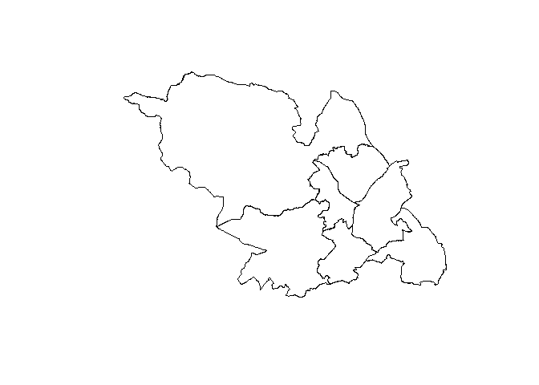
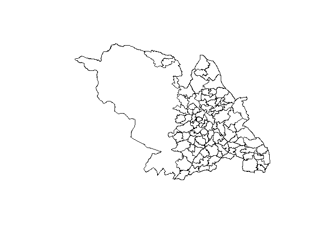
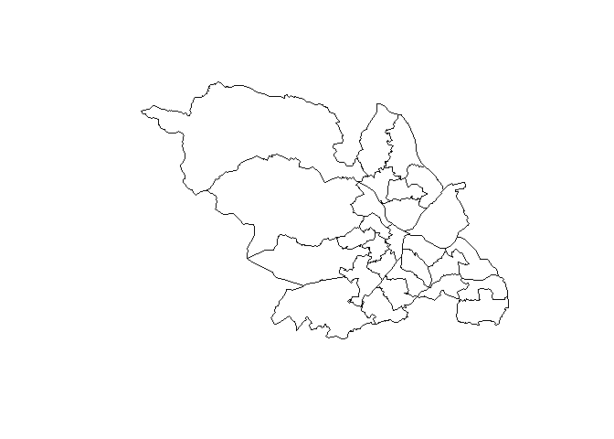
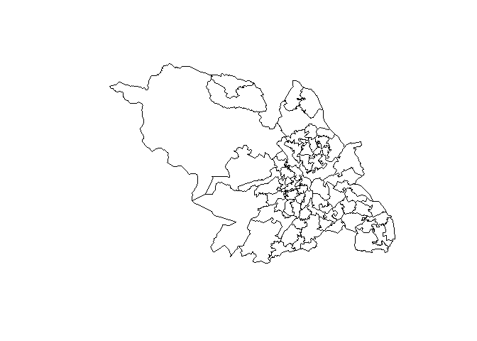
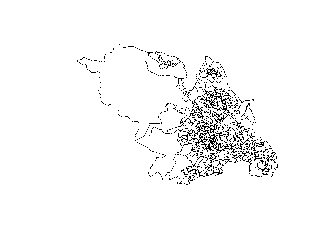
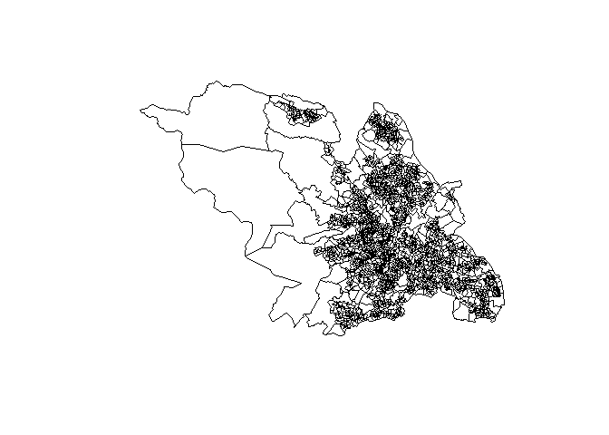

boundsheff
================

# Overview

boundsheff is an R package containing area boundaries for Sheffield as
[simple features](https://r-spatial.github.io/sf/articles/sf1.html).

# Installation

You can install the development version from GitHub with:

``` r
# install.packages("devtools")
devtools::install_github("scc-pi/boundsheff")
```

If you work for Sheffield City Council you can install the binary
package for Windows from:

> S:\\BI Team\\ShareToAll\\RPackages

Using RStudio you can does this via the *Tools \> Install packages…*
menu.

# Sources

The data is from the [ONS Open Geography
Portal](https://scc-pi.github.io/notes/spatial-data-sources.html#open-geography),
[SCC AGOL](https://sheffieldcc.maps.arcgis.com/) (ArcGIS Online), or the
[SCC Portal](https://sheffieldcitycouncil.cloud.esriuk.com/portal/home/)
(ArcGIS Enterprise). The latter is behind the Council’s firewall.

# Sheffield boundaries

``` r
library(boundsheff)
library(sf)
```

## sf_asc_localities

ASC (Adult Social Care) locality boundaries.

``` r
plot(st_geometry(sf_asc_localities))
```

<!-- -->

## sf_nhood

100 neighbourhood boundaries.

``` r
plot(st_geometry(sf_nhood))
```

<!-- -->

## sf_ward

28 Ward boundaries.

``` r
plot(st_geometry(sf_ward))
```

<!-- -->

## sf_msoa

70 MSOA boundaries.

``` r
plot(st_geometry(sf_msoa))
```

<!-- -->

## sf_lsoa

345 LSOA boundaries.

``` r
plot(st_geometry(sf_lsoa))
```

<!-- -->

## sf_oa

1,817 Output Area boundaries.

``` r
plot(st_geometry(sf_oa))
```

<!-- -->
